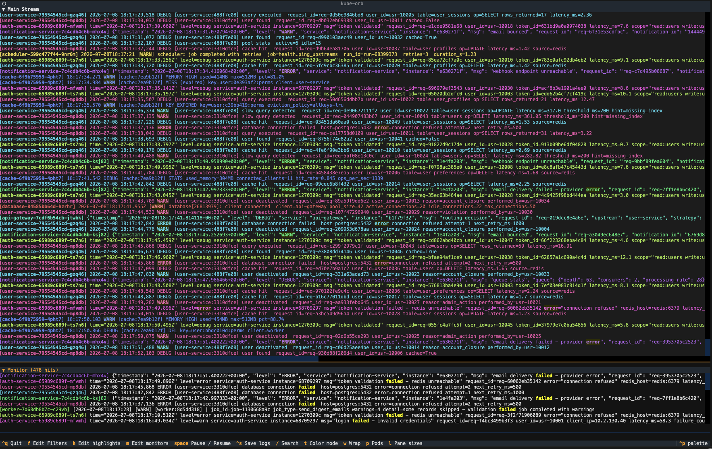

# kube-orb

Watching logs across a Kubernetes cluster usually means juggling multiple
`kubectl logs` windows and grepping after the fact, or writing complex regex 
just to add a couple of filters. kube-orb streams `kubectl logs -f` from every 
pod in your selected deployments into one merged, colorized view — and lets you 
filter, highlight, and search *while it's streaming*.

Built with [Textual](https://textual.textualize.io/), kube-orb is a full
terminal UI: an interactive setup wizard walks you through picking a namespace,
deployments, and filter patterns — no flags required — or skip straight to the
viewer with CLI arguments if you prefer. Save named session configs to reload
your exact setup later; passively collect rare events in a monitor panel
without losing your scroll position; get alerted when pods restart or go
unhealthy; and add or remove deployments from the live stream without
restarting.



## Features

- **Multi-pod live tail** — stream logs from any number of pods/deployments
  at once, each with a distinct color.
- **Filters** — hide lines matching a pattern, live-editable mid-session.
- **Highlights** — emphasize lines matching a pattern without hiding anything else.
- **Monitors** — passively collect matching lines into a separate panel so you
  can watch for rare events (e.g. `job failed`) without losing your scroll
  position in the main stream.
- **Live search** — search the whole buffered session, jump to a result, and
  keep streaming.
- **Pod health panel** — flags pods that aren't `Running` or have crossed a
  restart threshold; restart a pod or roll out a deployment restart from
  inside the app.
- **Dump mode** — fetch existing logs once (with `--tail`/`--since`) and exit,
  for scripting or one-off inspection, instead of a live stream.
- **Saved configs** — save a named combination of namespace, deployments, and
  patterns, and reload it later by name.
- **JSON log formatting** — auto-detects structured JSON log lines and shows
  `time  LEVEL  message  key=value ...` instead of a raw JSON blob, with a
  toggle back to raw and a detail view (Enter on a clicked line) for the full
  pretty-printed object.

## Installation

Requires Python 3.10+ and `kubectl` on your `PATH`, configured against the
cluster you want to inspect (kube-orb shells out to your existing `kubectl`
and inherits its context/auth — no separate credentials or Kubernetes client
library involved).

```bash
git clone https://github.com/adlidev/kube-orb.git
cd kube-orb
pip install -e .
# or, with uv:
uv pip install -e .
```

This installs two commands: `kube-orb` and `kube-orb-inject` (a small test
utility — see the [User Guide](docs/USER_GUIDE.md#kube-orb-inject)).

## Quick start

```bash
# No arguments — launches the interactive setup wizard
kube-orb

# Skip the wizard: watch two deployments live
kube-orb -n production -p api-gateway -p auth-service

# Watch every deployment in a namespace
kube-orb -n staging --all-pods

# One-shot dump instead of a live stream
kube-orb -n staging --dump --tail 500

# Pre-filter/highlight from the command line
kube-orb -n default -p worker -f DEBUG -H ERROR --health
```

Once you're in the viewer, press `F` / `H` / `M` to edit filters, highlights,
or monitors live, `/` to search, `P` to add/remove streamed deployments, and
`Space` to pause. See the [User Guide](docs/USER_GUIDE.md) for the full
keybinding reference and pattern syntax.

## Development

```bash
pip install -e . --group dev
pytest                    # run the test suite
textual run --dev src/kube_orb/__main__.py   # live-reload dev mode
```

A local, disposable k3d cluster with fake log-generating services is included
for manual testing — see [`CLAUDE.md`](CLAUDE.md) for setup and architecture
notes.

## License

[MIT License](LICENSE)
